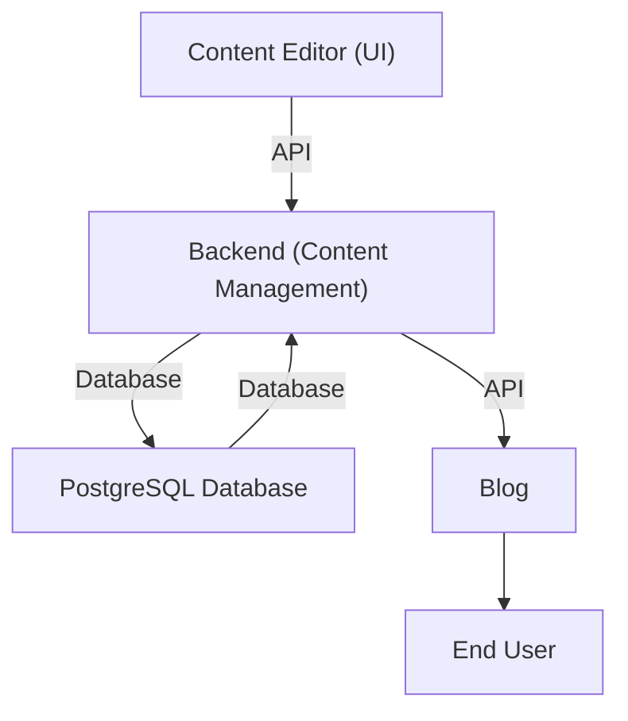

## 1. Introduction

The "**BurzContent**" Content Management System (CMS) will allow users to
create, edit, manage, and publish content (primarily blogs and web article). The
system will have a user-friendly interface and will be accessible to admins,
content creators, and viewers in addition to providing a developer-friendly API
to hook custom end-user website on to. It will support various media formats and
offer features like versioning, user roles, access control, and content approval
workflows, etc.

## 2. System Overview

The CMS will consist of several components interacting through various layers.
The major components are:

- **Frontend**, the client-side UI/UX layer.
- **Backend**, the server-side layer providing a developer API and an internal
  layer for the client-side to communicate with.
- **Database**, for data storage and performing CRUD operations.
- **Content Delivery Network (CDN)**, for optimising asset delivery (like images
  and visual contents).
- **Authentication & Authorization Service**, for users (like the editors,
  writers and administrators).

## 3. Architecture

### 3.1 Frontend Layer

The frontend layer is responsible for the user interface and experience (UI/UX)
of the CMS. It will be a web-based application that internally interacts with
the backend layer via REST API endpoints (these particular endpoints are not
exposed publicly).

- **Components:**

  - **Admin Dashboard**: Interface for administrators to manage users, content,
    settings, etc.
  - **Content Editor**: Rich text editor to create and edit content.
  - **Viewer Interface**: Public-facing content display page.

- **Technologies:**
  - Nuxt.js (Vue.js framework for SSR)
  - HTML5, CSS3, TypeScript
  - RESTful APIs for backend communication

### 3.2 Backend Layer

The backend layer handles business logic, user authentication, content
management, and data storage.

- **Components:**

  - **Content Management**: CRUD operations (Create, Read, Update, Delete) for
    managing content.
  - **User Management**: Handles user registration, login, and role-based access
    control.
  - **Approval Workflow**: Allows content moderation and approval before
    publishing.
  - **Notification Service**: Sends emails or notifications to users about
    content approvals, comments, etc.

### 3.3 Database Layer

The database stores the content, user data, media files, and other relevant
information. It should be optimized for performance and scalability.

- **Components:**

  - **Relational Database (SQL)**: Store user data, roles, permissions, and
    structured content.
  - **Object Storage**: For media files like images, videos (e.g., AWS S3).

- **Technologies:**
  - PostgreSQL for structured data

### 3.4 Authentication & Authorization Service

A critical component for securing the CMS. It will provide role-based access
control (RBAC) and ensure only authorized users can perform certain actions.

- **Components:**

  - **Login/Logout**: User authentication with username/password.
  - **Role-based Access Control (RBAC)**: Admins, Editors, and Viewers have
    different permissions.
  - **OAuth2 Integration**: For social logins (optional).

- **Technologies:**
  - OAuth2, JWT (JSON Web Tokens)

## 4. User Roles and Permissions

- **Admin**: Full access to manage content, users, settings, etc.
- **Editor**: Create, edit, and approve content.
- **Viewer**: Can view published content.

## 5. Content Workflow

- **Content Creation**: Authors can create new content via the content editor.
- **Approval Process**: Editors review and approve content before publishing.
- **Publishing**: Content is published to the CMS and made accessible to viewers
  via a separate website which will fetch the contents from the CMS through an
  API.

## 6. Key Features

- **Content Versioning**: Store multiple versions of content, allowing rollback
  to a previous version.
- **Media Management**: Upload, manage, and display various media types.
- **Commenting System**: Allow users to comment on public content (if enabled).
- **Search**: Implement search functionality to allow users to find content
  based on keywords.
- **Localization**: Support for multi-language content.

## 7. Data Flow Diagram (DFD)

A DFD illustrates the flow of data between components:

1. **Content Editor** (UI) -> API -> **Backend (Content Management)**
2. **Backend** -> Database for storage (PostgreSQL)
3. **Blog** -> Backend -> API -> Database (PostgreSQL)
4. **Blog** -> End User

## 8. Technology Stack

- **Frontend**: [Nuxt.js](https://nuxt.com) ([Vue.js](https://vuejs.org)
  framework for SSR)
- **Backend**: [Go](https://go.dev)
- **Database**: [PostgreSQL](https://www.postgresql.org)
- **Authentication**: [OAuth2](https://oauth.net/2)
- **Storage**: [Amazon S3](https://aws.amazon.com/s3)

## 9. Scalability Considerations

Scalability is not a matter of concern for the CMS at the moment.

This high-level design is modular, scalable, and secure, ensuring smooth
operation for a CMS at any scale. Each component can be independently upgraded
or scaled to meet future demands.
