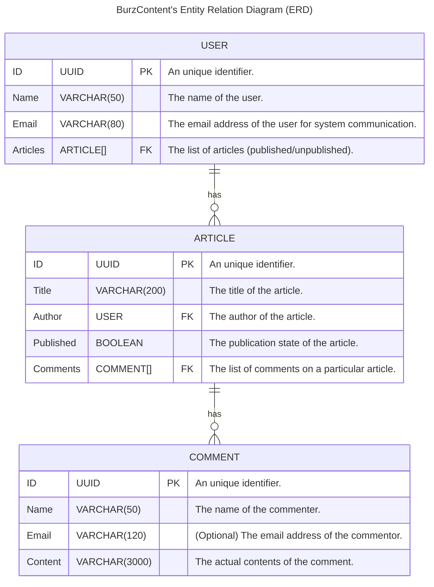
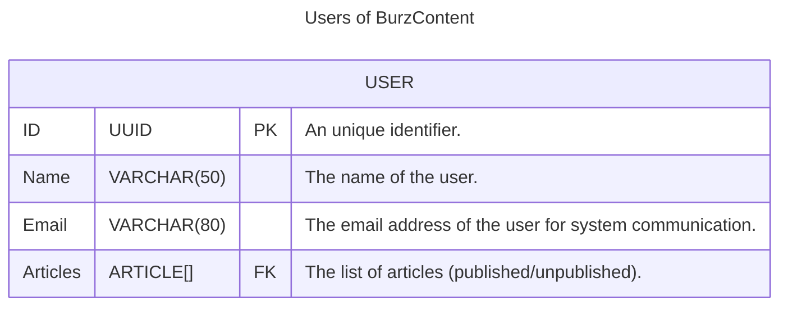
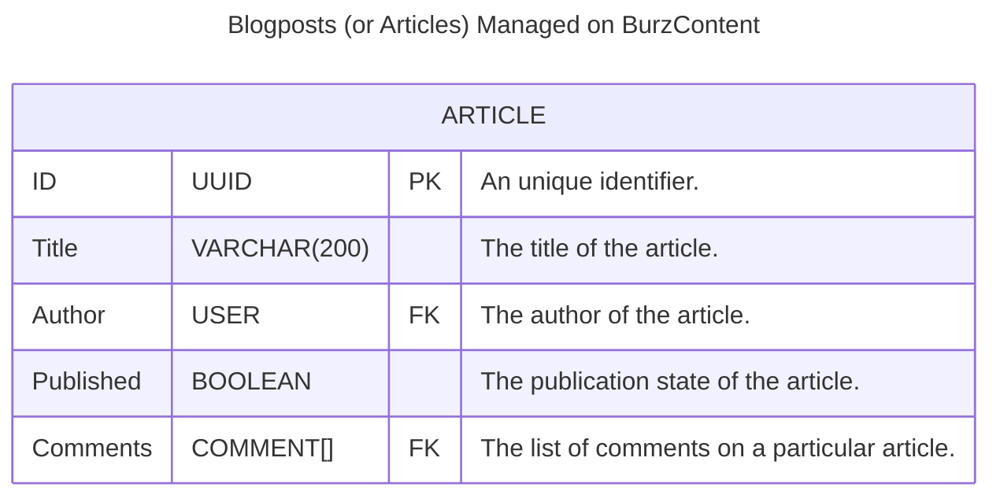
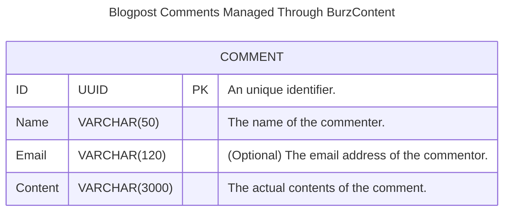

This document provides a low-level architectural design of the system for both
developer reference (and for those interested in studying the tool for personal
fulfillment). The system consists of three primary entities:

1. The "**Users**" are those who can directly interact with and use the platform
   after authenticating themselves to it.
2. An "**Article**" is a piece of content a "**User**" can write using the
   platform.
3. The "**Comments**" are pieces of feedback provided by the readers of a
   blogpost (which is managed by the platform) on it.

The diagram below describes the relationship between the aforementioned entities
in brief. A later section of the document will provide a more thorough
walkthrough of the relevant entity for further reference.

To summarise it all, you can read the next succeeding section for a brief
overview.

### Entities and Relationships

1. **USER** The [`USER`](#users) entity represents individuals in the system who
   create and interact with content. Users can author multiple articles and
   participate in discussions through comments.

2. **ARTICLE** The [`ARTICLE`](#articles) entity represents pieces of content
   authored by users. Each article is linked to a specific user (the author) and
   can have multiple comments from users. Articles have a publication state,
   indicating whether they are published or still in draft.

3. **COMMENT** The [`COMMENT`](#comments) entity represents feedback left by
   users on articles. Each comment is associated with a specific article, and
   users can choose to leave their name and email when commenting.

### Key Relationships

- **User to Article (One-to-Many):** A user can write multiple articles, but
  each article has one author.
- **Article to Comment (One-to-Many):** An article can have multiple comments,
  but each comment belongs to one specific article.

## Entities of the System

As mentioned earlier the platform consists of these entities are - "**Users**",
"**Articles**" and "**Comments**" each interacting with one another in certain
ways. This section of the document provides a detailed walkthrough of those
exact interactions. The interactions between the entities is what defines the
overall UI/UX of the platform to its end users.

### Users

This section describes the structure of the `USER` entity in BurzContent,
focusing on the attributes that define a user and their relationship with the
content they interact with.

The `USER` entity represents an individual registered within the BurzContent
system. Users are key participants, and they have several attributes that define
their identity, preferences, and interactions with the system.

#### Attributes

- **ID (UUID)**

  - **Type:** UUID
  - **Description:** A universally unique identifier (UUID) assigned to each
    user. This field acts as the primary key for the user entity, ensuring that
    every user is distinct within the system.

- **Name (VARCHAR(50))**

  - **Type:** String (up to 50 characters)
  - **Description:** The full name of the user. This is typically used for
    displaying the user's information across the system.

- **Email (VARCHAR(80))**

  - **Type:** String (up to 80 characters)
  - **Description:** The email address of the user. This field is used for
    system notifications, communication, and login purposes. It should be unique
    and validated to ensure proper communication.

- **Articles (ARTICLE[] FK)**
  - **Type:** Array of [`ARTICLE`](#articles) references
  - **Description:** A list of articles authored by or associated with the user.
    This field is a foreign key, pointing to the [`ARTICLE`](#articles) entity,
    and it represents all the content that the user has written, whether
    published or unpublished.

#### Relationships

- **User to Articles (One-to-Many)** The relationship between [`USER`](#users)
  and [`ARTICLE`](#articles) is one-to-many, meaning a single user can have
  multiple articles associated with their account. The [`Articles`](#articles)
  field in the [`USER`](#users) entity references an array of
  [`ARTICLE`](#articles) entities, linking the user to the content they create.

### Articles

This section describes the structure of the [`ARTICLE`](#articles) entity in
BurzContent, focusing on the attributes that define an article and its
relationship with users and comments.

The [`ARTICLE`](#articles) entity represents a piece of content published or
drafted by a user in the BurzContent system. Articles have several key
attributes that describe the content, its publication state, and associated
interactions.

#### Attributes

- **ID (UUID)**

  - **Type:** UUID
  - **Description:** A universally unique identifier (UUID) assigned to each
    article. This field acts as the primary key for the article entity, ensuring
    that every article is distinct within the system.

- **Title (VARCHAR(200))**

  - **Type:** String (up to 200 characters)
  - **Description:** The title of the article. This field is used for displaying
    the title of the article in various parts of the system.

- **Author (USER FK)**

  - **Type:** Foreign Key (USER)
  - **Description:** A reference to the user who authored the article. This
    field links the article to the [`USER`](#users) entity, representing the
    creator of the article.

- **Published (BOOLEAN)**

  - **Type:** Boolean
  - **Description:** The publication state of the article. It indicates whether
    the article has been published (`true`) or is still in draft mode (`false`).

- **Comments (COMMENT[] FK)**
  - **Type:** Array of [`COMMENT`](#comments) references
  - **Description:** A list of comments associated with the article. This field
    is a foreign key, linking the article to the [`COMMENT`](#comments) entity,
    and represents all comments made on the article by users.

#### Relationships

- **Article to User (Many-to-One)** The relationship between
  [`ARTICLE`](#articles) and [`USER`](#users) is many-to-one, meaning multiple
  articles can be authored by a single user. The `Author` field in the
  [`ARTICLE`](#articles) entity references a [`USER`](#users) entity, linking
  the article to its author.

- **Article to Comments (One-to-Many)** The relationship between
  [`ARTICLE`](#articles) and [`COMMENT`](#comments) is one-to-many, meaning an
  article can have multiple comments associated with it. The `Comments` field in
  the [`ARTICLE`](#articles) entity references an array of
  [`COMMENT`](#comments) entities, linking the article to its associated
  comments.

### Comments

This section describes the structure of the [`COMMENT`](#comments) entity in
BurzContent, focusing on the attributes that define a comment and its role
within the system.

The [`COMMENT`](#comments) entity represents a comment made by a user on an
article within the BurzContent system. Comments are a form of user interaction
with content, allowing users to express feedback or opinions.

#### Attributes

- **ID (UUID)**

  - **Type:** UUID
  - **Description:** A universally unique identifier (UUID) assigned to each
    comment. This field acts as the primary key for the comment entity, ensuring
    that every comment is distinct within the system.

- **Name (VARCHAR(50))**

  - **Type:** String (up to 50 characters)
  - **Description:** The name of the commenter. This is the name that will be
    displayed alongside the comment to identify the commenter.

- **Email (VARCHAR(120))**

  - **Type:** String (up to 120 characters)
  - **Description:** The email address of the commenter. This field is optional
    and used for communication or notifications, if provided.

- **Content (VARCHAR(3000))**
  - **Type:** String (up to 3000 characters)
  - **Description:** The actual content of the comment. This field stores the
    text written by the commenter and provides the content that appears on the
    article.

#### Relationships

- **Comment to Article (Many-to-One)** Each comment is associated with a
  specific article. Though not explicitly stated in the diagram, it's implied
  that each comment is linked to an article in a many-to-one relationship,
  meaning multiple comments can belong to a single article.

