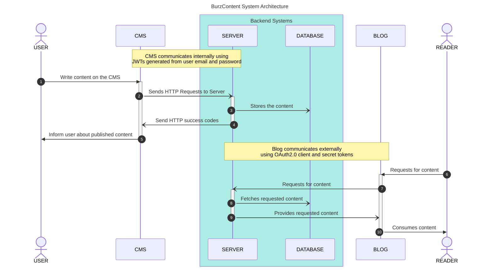
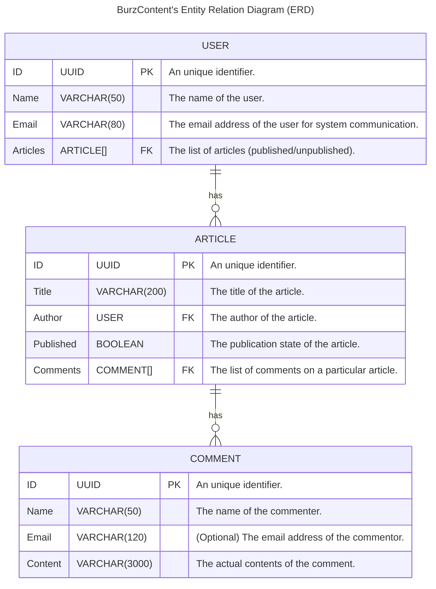
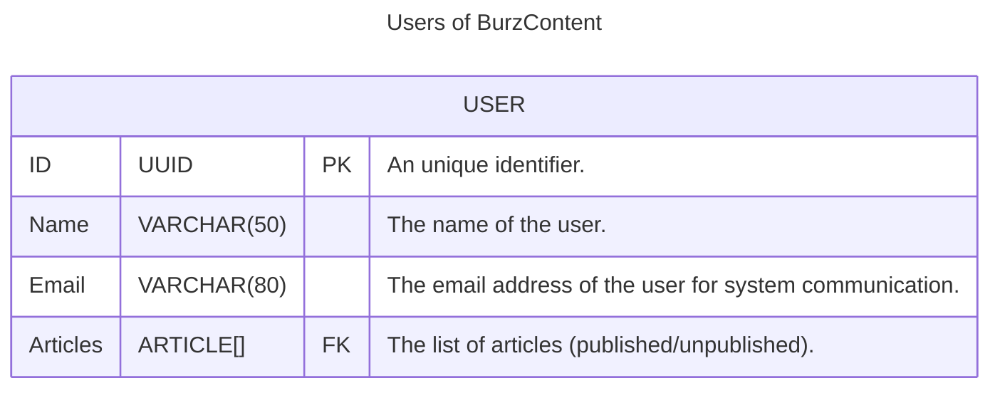
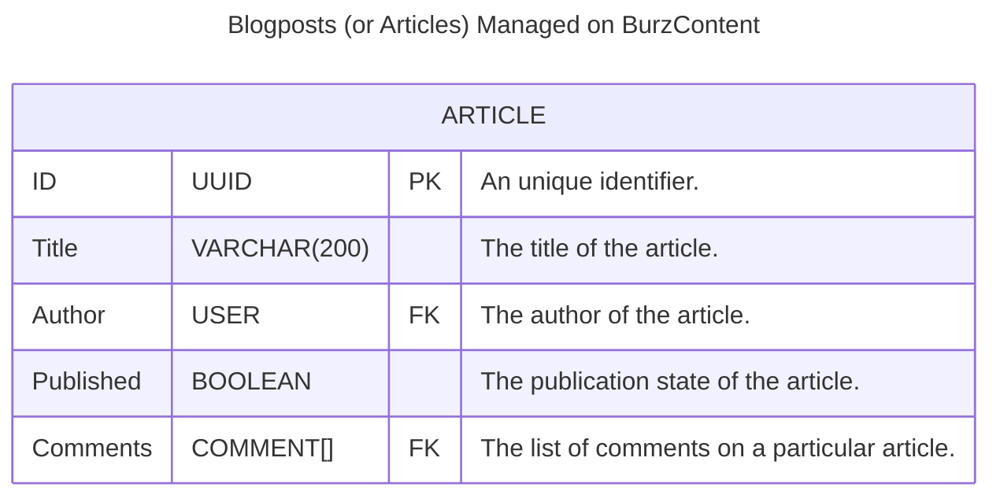
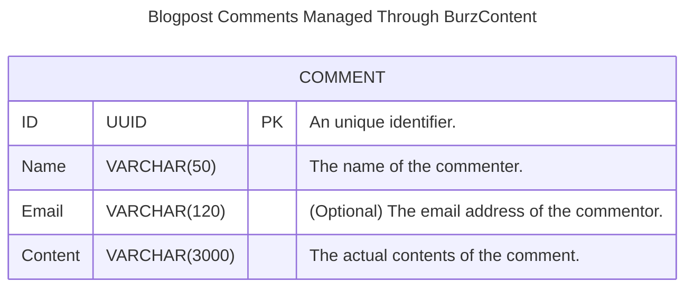

This document provides a low-level architectural design of the system for both
developer reference (and for those interested in studying the tool for personal
fulfillment). The document will walk you through the the underlying architecture
of the system and then the relationships between the entities of the system.

## System Architecture & Service Integration Design

The entire system is powered by multiple services each working in tandem and
communicating with each other through REST API endpoints. The architectural
pattern of how the services intermingle with each other is detailed in the
diagram below:

<!-- TODO: Use the "architecture" diagrams (when they are supported). -->
<!-- Current implementation of the dependendencies don't support Mermaid v11.1.0+ -->



If you have familiarised yourself with the overall system architectural designs
of the system you should proceed towards learning about the entities of involved
within the system.

As is evident from the diagram provided above, the system has the following core
services:

1. The "**server**" responsible for receiving and handling HTTP requests from
   clients (could be the CMS or a blog).
2. The "**client(s)**" are responsible for providing an interactive platform to
   the users/readers.
3. The "**database**" is responsible for storage purposes only which is
   accessible only through the "**server**".

More details on the implementations of the aforementioned services are provided
in a later section of the document.

## Structure of Key Entities in the System

The system consists of three primary entities:

1. The "**Users**" are those who can directly interact with and use the platform
   after authenticating themselves to it.
2. An "**Article**" is a piece of content a "**User**" can write using the
   platform.
3. The "**Comments**" are pieces of feedback provided by the readers of a
   blogpost (which is managed by the platform) on it.

The diagram below describes the relationship between the aforementioned entities
in brief. A later section of the document will provide a more thorough
walkthrough of the relevant entity for further reference.



To summarise it all, you can read the next succeeding section for a brief
overview.

1. **USER** The [`USER`](#users) entity represents individuals in the system who
   create and interact with content. Users can author multiple articles and
   participate in discussions through comments.

2. **ARTICLE** The [`ARTICLE`](#articles) entity represents pieces of content
   authored by users. Each article is linked to a specific user (the author) and
   can have multiple comments from users. Articles have a publication state,
   indicating whether they are published or still in draft.

3. **COMMENT** The [`COMMENT`](#comments) entity represents feedback left by
   users on articles. Each comment is associated with a specific article, and
   users can choose to leave their name and email when commenting.

The key relationships between the entities can be summarised as:

- **User to Article (One-to-Many):** A user can write multiple articles, but
  each article has one author.
- **Article to Comment (One-to-Many):** An article can have multiple comments,
  but each comment belongs to one specific article.

As mentioned earlier the platform consists of these entities are - "**Users**",
"**Articles**" and "**Comments**" each interacting with one another in certain
ways. This section of the document provides a detailed walkthrough of those
exact interactions. The interactions between the entities is what defines the
overall UI/UX of the platform to its end users.

### Users

This section describes the structure of the `USER` entity in BurzContent,
focusing on the attributes that define a user and their relationship with the
content they interact with.

The `USER` entity represents an individual registered within the BurzContent
system. Users are key participants, and they have several attributes that define
their identity, preferences, and interactions with the system.

#### Attributes

- **ID (UUID)**

  - **Type:** UUID
  - **Description:** A universally unique identifier (UUID) assigned to each
    user. This field acts as the primary key for the user entity, ensuring that
    every user is distinct within the system.

- **Name (VARCHAR(50))**

  - **Type:** String (up to 50 characters)
  - **Description:** The full name of the user. This is typically used for
    displaying the user's information across the system.

- **Email (VARCHAR(80))**

  - **Type:** String (up to 80 characters)
  - **Description:** The email address of the user. This field is used for
    system notifications, communication, and login purposes. It should be unique
    and validated to ensure proper communication.

- **Articles (ARTICLE[] FK)**
  - **Type:** Array of [`ARTICLE`](#articles) references
  - **Description:** A list of articles authored by or associated with the user.
    This field is a foreign key, pointing to the [`ARTICLE`](#articles) entity,
    and it represents all the content that the user has written, whether
    published or unpublished.

#### Relationships

- **User to Articles (One-to-Many)** The relationship between [`USER`](#users)
  and [`ARTICLE`](#articles) is one-to-many, meaning a single user can have
  multiple articles associated with their account. The [`Articles`](#articles)
  field in the [`USER`](#users) entity references an array of
  [`ARTICLE`](#articles) entities, linking the user to the content they create.



### Articles

This section describes the structure of the [`ARTICLE`](#articles) entity in
BurzContent, focusing on the attributes that define an article and its
relationship with users and comments.

The [`ARTICLE`](#articles) entity represents a piece of content published or
drafted by a user in the BurzContent system. Articles have several key
attributes that describe the content, its publication state, and associated
interactions.

#### Attributes

- **ID (UUID)**

  - **Type:** UUID
  - **Description:** A universally unique identifier (UUID) assigned to each
    article. This field acts as the primary key for the article entity, ensuring
    that every article is distinct within the system.

- **Title (VARCHAR(200))**

  - **Type:** String (up to 200 characters)
  - **Description:** The title of the article. This field is used for displaying
    the title of the article in various parts of the system.

- **Author (USER FK)**

  - **Type:** Foreign Key (USER)
  - **Description:** A reference to the user who authored the article. This
    field links the article to the [`USER`](#users) entity, representing the
    creator of the article.

- **Published (BOOLEAN)**

  - **Type:** Boolean
  - **Description:** The publication state of the article. It indicates whether
    the article has been published (`true`) or is still in draft mode (`false`).

- **Comments (COMMENT[] FK)**
  - **Type:** Array of [`COMMENT`](#comments) references
  - **Description:** A list of comments associated with the article. This field
    is a foreign key, linking the article to the [`COMMENT`](#comments) entity,
    and represents all comments made on the article by users.

#### Relationships

- **Article to User (Many-to-One)** The relationship between
  [`ARTICLE`](#articles) and [`USER`](#users) is many-to-one, meaning multiple
  articles can be authored by a single user. The `Author` field in the
  [`ARTICLE`](#articles) entity references a [`USER`](#users) entity, linking
  the article to its author.

- **Article to Comments (One-to-Many)** The relationship between
  [`ARTICLE`](#articles) and [`COMMENT`](#comments) is one-to-many, meaning an
  article can have multiple comments associated with it. The `Comments` field in
  the [`ARTICLE`](#articles) entity references an array of
  [`COMMENT`](#comments) entities, linking the article to its associated
  comments.



### Comments

This section describes the structure of the [`COMMENT`](#comments) entity in
BurzContent, focusing on the attributes that define a comment and its role
within the system.

The [`COMMENT`](#comments) entity represents a comment made by a user on an
article within the BurzContent system. Comments are a form of user interaction
with content, allowing users to express feedback or opinions.

#### Attributes

- **ID (UUID)**

  - **Type:** UUID
  - **Description:** A universally unique identifier (UUID) assigned to each
    comment. This field acts as the primary key for the comment entity, ensuring
    that every comment is distinct within the system.

- **Name (VARCHAR(50))**

  - **Type:** String (up to 50 characters)
  - **Description:** The name of the commenter. This is the name that will be
    displayed alongside the comment to identify the commenter.

- **Email (VARCHAR(120))**

  - **Type:** String (up to 120 characters)
  - **Description:** The email address of the commenter. This field is optional
    and used for communication or notifications, if provided.

- **Content (VARCHAR(3000))**
  - **Type:** String (up to 3000 characters)
  - **Description:** The actual content of the comment. This field stores the
    text written by the commenter and provides the content that appears on the
    article.

#### Relationships

- **Comment to Article (Many-to-One)** Each comment is associated with a
  specific article. Though not explicitly stated in the diagram, it's implied
  that each comment is linked to an article in a many-to-one relationship,
  meaning multiple comments can belong to a single article.



## Implementation and Structuring Details

As previously mentioned, the system includes the following pre-configured
services:

- **Server**: This is the server-side component.
- **Content Management System (CMS)**: This is the client-side application.

The CMS is the primary web interface available to end users, allowing them to
manage their blog posts and related content. It interacts with the server-side
service (the **Server**) via REST APIs to handle persistent data storage and
platform management tasks (such as adding users). The server-side service also
exposes several public REST API endpoints, which can be accessed by third-party
blogs.

The project follows the
[**Model-View-Controller (MVC)**](https://developer.mozilla.org/en-US/docs/Glossary/MVC)
design pattern, which simplifies source code organization and maintenance. The
structure of the project's source code is organized as follows:

**Project Root Directory**:

```console
.
├── .github/
│   └── ...
├── assets/
│   └── ...
├── docs/
│   └── ...
├── server/
│   └── ...
├── cms/
│   └── ...
├── ...
├── README
└── LICENSE
```

The representation above shows the structure at the root of the project's
repository. While it's fairly self-explanatory, here's a brief overview of each
directory and its purpose:

1. The `.github` directory contains GitHub Action workflows, Dependabot
   configurations, and other related files.
2. The `assets` directory holds logos, screenshots, and other media files.
3. The `docs` directory contains the Starlight source code for this
   documentation site (the one you're currently reading).
4. The `server` directory holds the Go source code responsible for powering the
   server-side service of BurzContent.
5. The `cms` directory contains the interactive web application that allows
   users to manage their blogs.
6. The remaining files include the `README`, `LICENSE`, and other essential
   documents.

**On the Server-Side**:

```console
.
├── ...
├── handlers/
│   └── ...
├── models/
│   └── ...
├── services/
│   └── ...
└── ...
```

In accordance with common practices among other Go projects, the directories in
the source code have been named based on the context they serve. For example,
the `handlers` directory contains the logic for receiving HTTP traffic from the
client-side services (or applications). Similarly, the `models` and `services`
directories contain the logic for querying data from a persistent storage medium
and the logic for serving that data to a handler, respectively.

Retrospectively, the structure described above can be mapped to the following
MVC pattern, which is commonly used in other programming languages:

- The `models` directory can be considered the "**Model**" part of the pattern.
- The `handlers` directory can be considered the "**View**" part of the pattern.
- The `services` directory can be considered the "**Controller**" part of the
  pattern.

<!-- prettier-ignore-start -->
:::note
The project structure outlined above is intended as a **guideline only**, and
the organization of the source code may change over time.
:::
<!-- prettier-ignore-end -->

Additionally, the server-side service uses the
"[Dependency Injection](https://www.jetbrains.com/guide/go/tutorials/dependency_injection_part_one)"
technique, which is a key recommendation in the MVC design pattern for writing
maintainable software. Components of the system are initialized with their
dependencies injected during instantiation. Below is an example Go source code
that demonstrates this technique:

```go
package main

type UserService interface {
    // ... all the methods to be supported by the "user service" type
}

type UserServiceImpl struct {
    // ... create a struct of the "user service" to instantiate with
}

// Instantiate a new instance of the "user service" type
func NewUserService() *UserServiceImpl {
    return &UserServiceImpl{
        // ...
    }
}

func (us *UserServiceImpl) GetAllUsers() ([]Users, error) {
    // ... Implement a method on the "user service" type
}

// Create a struct which embeds a "UserService" struct
type UserHandler struct {
	UserService UserService
}

// Inject the "UserService" dependency when instantiating the "UserHandler"
// struct
func NewUserHandler(userService UserService) *UserHandler {
    return &UserHandler{
        UserService: userService
    }
}

func (us *UserServiceHandler) GetAllUsers() ([]Users, error) {
    // ... Implement a method on the "user handler" type
}

func main() {
    // ... initialise the handlers here
}
```

<!-- prettier-ignore-start -->

:::tip
To learn more about organizing Go source code according to the MVC pattern, refer to the following articles:
1. [Using MVC to Structure Go Web Applications](https://www.calhoun.io/using-mvc-to-structure-go-web-applications) by Jon Calhoun.
2. [A Collection of Structuring Go](https://ldej.nl/post/structuring-go) by Laurence de Jong.
:::

<!-- prettier-ignore-end -->

## On the Client-Side

On the client-side, there are two ways to consume data from the server:

- Through the pre-packaged CMS provided by the system.
- Through the REST API endpoints exposed by the server, which can be consumed by
  third-party applications (such as a blog).

While BurzContent does not include a third-party application (like a blog), it
does provide an interactive CMS as a web application. This web application is
built using the [Nuxt.js](https://nuxt.com) framework to offer users a modern
and responsive experience. For more information on developing the client-side
application (i.e., the CMS), check out
[the official Nuxt.js documentation](https://nuxt.com/docs/getting-started/introduction).

<!-- prettier-ignore-start -->

:::note
Users of BurzContent are free to consume the public REST API endpoints using any
application built on any technology stack capable of making network requests and
handling JSON data. The system does not impose any specific opinions on how the
public REST API should be consumed.
:::

<!-- prettier-ignore-end -->
